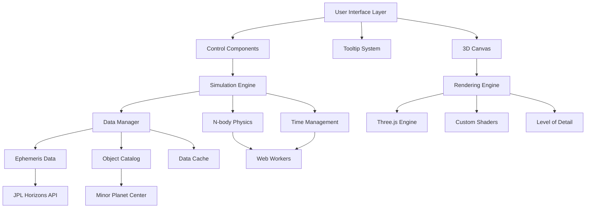
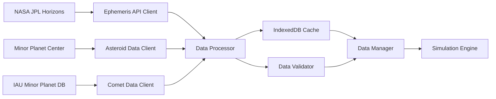
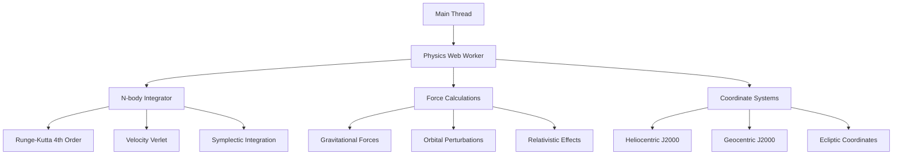
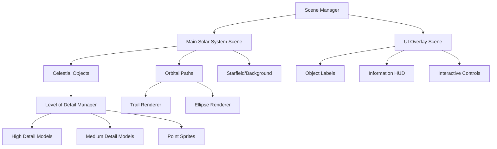
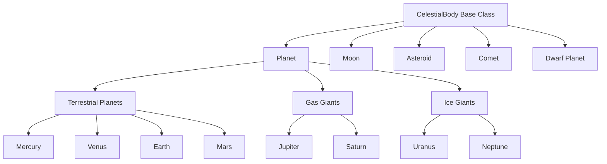
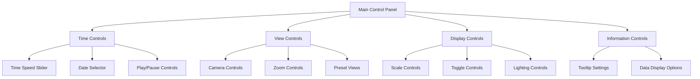
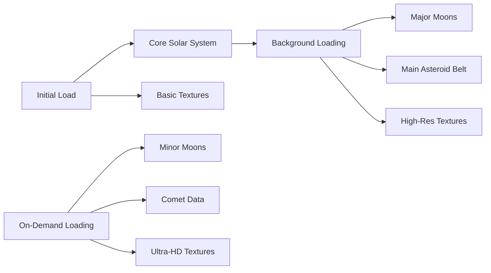
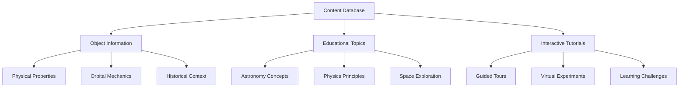
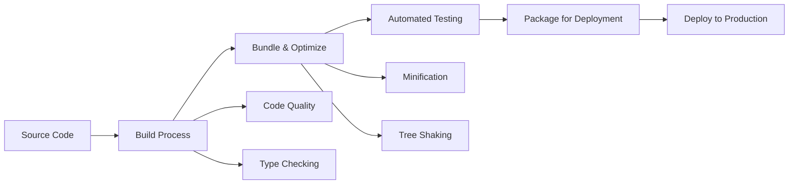

# 3D Solar System Visualization - Architectural Design

## Project Overview
Professional-grade 3D solar system visualization web application with:
- Real astronomical data and N-body physics simulation
- Support for planets, moons, dwarf planets, asteroids, and comets
- Historical/future date simulation capabilities
- Interactive controls and educational tooltips
- High-performance 3D rendering

## 1. Core Technology Stack

### Frontend Framework
- **Vanilla JavaScript ES6+ with modules** - For maximum performance and control
- **Alternative**: React.js for component architecture (if maintainability > performance)

### 3D Rendering Engine
- **Three.js** (primary) - Industry standard WebGL wrapper
- **WebGL 2.0** - Direct access for performance-critical operations
- **Web Workers** - For physics calculations and data processing

### Physics & Mathematics
- **Custom N-body integrator** - Runge-Kutta 4th order or Velocity Verlet
- **Math.js** - Advanced mathematical operations
- **ML-Matrix** - Linear algebra operations for coordinate transformations

### Data Sources & APIs
- **NASA JPL Horizons System** - Ephemeris data via HTTP API
- **Minor Planet Center (MPC)** - Asteroid and comet orbital elements
- **Custom data pipeline** - Process and cache astronomical data

### Build Tools & Dependencies
- **Vite** - Fast build tool and dev server
- **TypeScript** - Type safety for complex calculations
- **ESLint + Prettier** - Code quality and formatting
- **Vitest** - Unit testing framework

## 2. System Architecture



## 3. Project Structure

```
solar-system-viz/
├── src/
│   ├── core/
│   │   ├── Engine.js                 # Main application engine
│   │   ├── SimulationEngine.js       # Physics and time simulation
│   │   ├── RenderEngine.js           # 3D rendering management
│   │   └── DataManager.js            # Data loading and caching
│   ├── physics/
│   │   ├── NBodyIntegrator.js        # N-body physics calculations
│   │   ├── KeplerianOrbit.js         # Keplerian orbital mechanics
│   │   ├── Perturbations.js          # Gravitational perturbations
│   │   └── CoordinateTransform.js    # Coordinate system conversions
│   ├── celestial/
│   │   ├── CelestialBody.js          # Base celestial body class
│   │   ├── Planet.js                 # Planet-specific implementation
│   │   ├── Moon.js                   # Moon-specific implementation
│   │   ├── Asteroid.js               # Asteroid implementation
│   │   ├── Comet.js                  # Comet implementation
│   │   └── BodyCatalog.js            # Celestial body registry
│   ├── rendering/
│   │   ├── SceneManager.js           # Three.js scene management
│   │   ├── LightingSystem.js         # Dynamic lighting
│   │   ├── MaterialManager.js        # Texture and material handling
│   │   ├── LODManager.js             # Level of detail optimization
│   │   ├── EffectsComposer.js        # Post-processing effects
│   │   └── shaders/
│   │       ├── planet.vert           # Planet vertex shader
│   │       ├── planet.frag           # Planet fragment shader
│   │       ├── atmosphere.vert       # Atmospheric effects
│   │       └── rings.frag            # Planetary rings shader
│   ├── ui/
│   │   ├── ControlPanel.js           # Main control interface
│   │   ├── Timeline.js               # Time control slider
│   │   ├── CameraControls.js         # Camera manipulation
│   │   ├── ScaleControls.js          # Size/distance scaling
│   │   ├── TooltipSystem.js          # Educational tooltips
│   │   └── components/
│   │       ├── Slider.js             # Reusable slider component
│   │       ├── Toggle.js             # Toggle switch component
│   │       └── InfoPanel.js          # Information display
│   ├── data/
│   │   ├── DataLoader.js             # API data fetching
│   │   ├── EphemerisClient.js        # JPL Horizons interface
│   │   ├── AsteroidCatalog.js        # MPC data processing
│   │   ├── TextureLoader.js          # Planet texture management
│   │   └── cache/
│   │       ├── CacheManager.js       # Data caching system
│   │       └── IndexedDBStorage.js   # Browser storage interface
│   ├── utils/
│   │   ├── MathUtils.js              # Mathematical utilities
│   │   ├── DateUtils.js              # Time/date conversions
│   │   ├── Constants.js              # Physical constants
│   │   ├── Performance.js            # Performance monitoring
│   │   └── Logger.js                 # Logging system
│   ├── workers/
│   │   ├── PhysicsWorker.js          # N-body calculations
│   │   ├── DataWorker.js             # Data processing
│   │   └── ComputeShaderWorker.js    # GPU compute shaders
│   └── assets/
│       ├── textures/                 # Planet and moon textures
│       ├── data/                     # Static astronomical data
│       └── shaders/                  # GLSL shader files
├── public/
│   ├── index.html
│   ├── manifest.json
│   └── icons/
├── tests/
│   ├── unit/
│   ├── integration/
│   └── accuracy/                     # Astronomical accuracy tests
├── docs/
│   ├── api/
│   ├── user-guide/
│   └── development/
├── config/
│   ├── vite.config.js
│   ├── tsconfig.json
│   └── env/

## 4. Data Management Architecture

### Data Sources Integration


### Data Flow Strategy
- **Ephemeris Data Pipeline**: JPL Horizons API → Processing → Validation → Cache → Simulation
- **Orbital Elements**: MPC/IAU → Element processing → Coordinate conversion → Integration
- **Texture Assets**: CDN/Local → Progressive loading → GPU memory management
- **Real-time Updates**: Periodic API calls for current positions vs historical simulation

### Caching Strategy
- **Level 1**: Memory cache for active objects (RAM-based, ~100MB limit)
- **Level 2**: IndexedDB for processed ephemeris data (disk-based, ~1GB limit)
- **Level 3**: Service Worker for static assets and textures
- **Cache Invalidation**: Time-based expiry + checksum validation

## 5. Physics Simulation Engine

### N-body Integration Architecture


### Performance Optimization for Physics
- **Hierarchical Force Calculation**: Barnes-Hut octree for distant objects
- **Variable Time Steps**: Adaptive step sizing based on orbital velocity
- **Multi-threading**: Separate workers for major planets vs asteroids/comets
- **GPU Acceleration**: WebGL compute shaders for parallel force calculations
- **Precision Management**: Double precision for positions, single for rendering

## 6. 3D Rendering Engine Architecture

### Three.js Scene Management


### Rendering Pipeline
- **Frustum Culling**: Remove objects outside camera view
- **Distance-based LOD**: Switch between detailed models and sprites
- **Instanced Rendering**: Batch similar objects (asteroids, stars)
- **Texture Streaming**: Progressive loading of high-resolution textures
- **Custom Shaders**: Planet atmospheres, ring systems, comet tails

### Visual Fidelity Features
- **Physically Based Rendering (PBR)**: Accurate material properties
- **Dynamic Lighting**: Sun as primary light source with realistic falloff
- **Atmospheric Scattering**: Rayleigh/Mie scattering for realistic atmospheres
- **Ring Systems**: Saturn's rings with particle-based rendering
- **Comet Tails**: Dynamic particle systems responding to solar wind

## 7. Celestial Body Management System

### Object Hierarchy


### Body Catalog Management
- **Dynamic Registration**: Add/remove objects at runtime
- **Metadata System**: Physical properties, orbital elements, visual settings
- **Grouping System**: Organize objects by type, family, or custom criteria
- **Search & Filter**: Find objects by name, type, or properties

## 8. UI/UX Component Architecture

### Control Panel Design


### Interactive Controls Implementation
- **Responsive Sliders**: Touch-friendly with keyboard support
- **Toggle Switches**: Visual feedback for orbital paths, labels, textures
- **Camera Controls**: Orbit, pan, zoom with smooth transitions
- **Scale Controls**: Independent size and distance scaling
- **Sun Illumination**: Adjustable intensity and color temperature

### Tooltip System Architecture
- **Context-Aware Display**: Different content based on object type
- **Progressive Loading**: Basic info first, detailed data on demand
- **Interactive Elements**: Links to related objects and concepts
- **Accessibility**: Screen reader support and keyboard navigation

## 9. Performance Optimization Strategy

### Rendering Optimizations
- **Level of Detail (LOD)**: Dynamic model complexity based on distance
- **Occlusion Culling**: Skip rendering objects hidden by others
- **Texture Atlasing**: Combine multiple textures to reduce draw calls
- **GPU Instancing**: Batch render identical objects (asteroids, stars)
- **Post-Processing**: Selective use of effects based on performance

### Memory Management
- **Object Pooling**: Reuse objects instead of creating/destroying
- **Texture Streaming**: Load/unload textures based on visibility
- **Garbage Collection**: Manual cleanup of unused resources
- **Memory Budgeting**: Allocate fixed budgets for different resource types

### Computational Optimizations
- **Web Workers**: Offload physics and data processing
- **WebAssembly**: Performance-critical calculations
- **GPU Computing**: Use WebGL for parallel computations
- **Adaptive Quality**: Automatically adjust quality based on frame rate

## 10. Data Loading and Caching Strategy

### Progressive Loading System


### Caching Architecture
- **Browser Storage**: IndexedDB for large datasets, localStorage for settings
- **Service Worker**: Cache static assets and API responses
- **Memory Cache**: Hot data for immediate access
- **CDN Integration**: Edge caching for global distribution

## 11. Responsive Design and Cross-Platform Compatibility

### Device Adaptation Strategy
- **Desktop**: Full feature set with keyboard/mouse controls
- **Tablet**: Touch-optimized interface with simplified controls
- **Mobile**: Essential features with gesture-based navigation
- **VR/AR**: Optional immersive experience mode

### Performance Tiers
- **High-End**: All features, maximum visual quality
- **Mid-Range**: Balanced features and performance
- **Low-End**: Essential features only, simplified rendering
- **Auto-Detection**: Hardware capability assessment on startup

## 12. Educational Content Management System

### Content Architecture


### Content Delivery
- **Dynamic Tooltips**: Context-sensitive information display
- **Interactive Panels**: Expandable information sections
- **Learning Paths**: Guided educational sequences
- **Multimedia Integration**: Images, videos, and interactive diagrams

## 13. Testing Strategy for Accuracy Validation

### Validation Framework
- **Unit Tests**: Individual component functionality
- **Integration Tests**: System component interactions
- **Accuracy Tests**: Astronomical position validation
- **Performance Tests**: Frame rate and memory usage
- **Cross-Browser Tests**: Compatibility across browsers

### Accuracy Validation
- **JPL Horizons Comparison**: Validate positions against NASA data
- **Historical Event Verification**: Check against known astronomical events
- **Orbital Mechanics Validation**: Verify Kepler's laws compliance
- **Energy Conservation**: Monitor total system energy over time

## 14. Deployment and Build System Architecture

### Build Pipeline


### Deployment Strategy
- **Static Hosting**: CDN-based deployment for global performance
- **Progressive Web App (PWA)**: Offline capabilities and app-like experience
- **Containerization**: Docker for development and staging environments
- **CI/CD Pipeline**: Automated testing and deployment
- **Monitoring**: Performance and error tracking in production

### Environment Management
- **Development**: Hot reload, debugging tools, mock data
- **Staging**: Production-like environment for testing
- **Production**: Optimized build with monitoring
- **Configuration Management**: Environment-specific settings
└── package.json